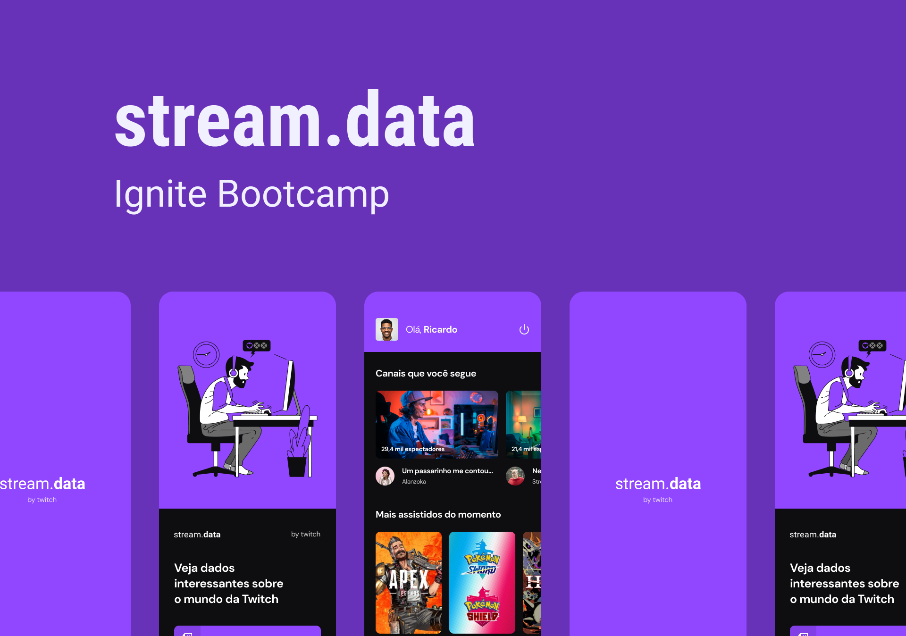

# stream.data challenge

<div align="center">



</div>

<h4 align="center">
  <a href="#technologies">Technologies</a>&nbsp;&nbsp;&nbsp;|&nbsp;&nbsp;&nbsp;
  <a href="#how-to-use">How To Use</a>&nbsp;&nbsp;&nbsp;|&nbsp;&nbsp;&nbsp;
  <a href="license">License</a>
</h4>

## 🏁 Demo


### 🎨 Layout

[Click here to open Figma](https://www.figma.com/file/MKVa3Q20VoeRS11RSTFcZ4/stream.data?node-id=1%3A131)

<h2 id="technologies">
  🚀 Technologies
</h2>

This project was developed at the Rocketseat Ignite Bootcamp as a challenge, with the following technologies.

- [React Native](https://reactnative.dev//)
- [TypeScript](https://www.typescriptlang.org/)
- [Styled Components](https://styled-components.com/)
- Expo Auth Session (Twitch)

<h2 id="how-to-use">
  ℹ️ How to use
</h2>

To clone and run this application, you'll need:

1. Git
2. Node.js
3. Yarn
4. Configured Android or iOS emulator

```bash
# Clone this repository
$ git clone https://github.com/cesarhilario/ignite-react-native.git
# Go into project
$ cd ignite-react-native/challenges/streamdata
# Install dependencies
$ yarn
# Start expo service
$ expo start
```

<h2 id="license">
  📝 License
</h2>

This project is under the MIT license. See the [LICENSE](https://github.com/cesarhilario/ignite-react-native/blob/main/LICENSE) for more information.

---

Made with ❤️ by César Hilário :wave: [Get in touch!](https://www.linkedin.com/in/cesarhilario/)
